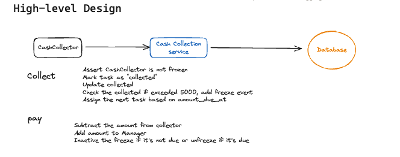
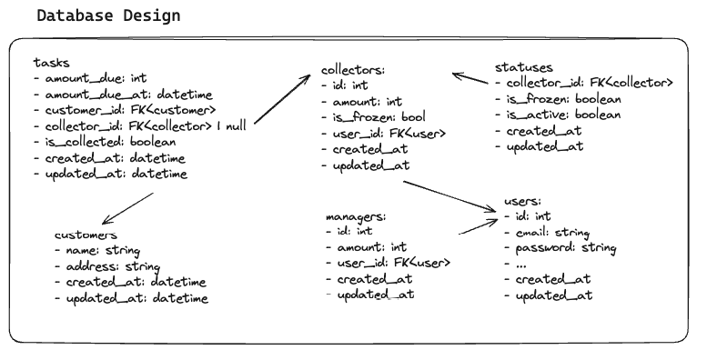
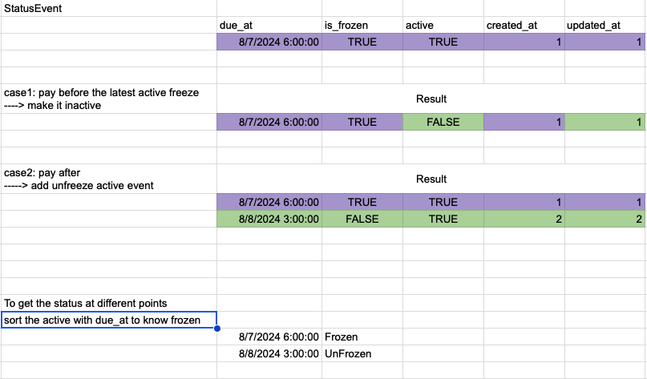

# Cash Collection

## Overview

This repo is a solution implementation to the cash collector problem.

### Contents

- [Design](#Design)
- [Approaches](#Approaches)
- [Deliverables](#Deliverables)
- [Installation](#Installation)

## Design





As I don't know much about the context of collectors and managers such as:
1. Can a collector be a manager at the same time?
2. Are there other possible people that hold cash?
3. Are there any other differences between the collector and manager?

I choose to simply represent them as two tables collectors and managers.
## Approaches

We have a challenge here which is the future automatic freeze in addition to be
able to show the freeze status at different time points.

So. I thought of two solutions:

1. When the collection passes the amount, add event to denote future freeze. And
   when paying, update the event or add new event to inactivate the future
   freezing or declare the unfreezing.
2. When the collection passes the amount, schedule a job to validate freezing
   after 2 days (the tolerance before actual freeze)

### 1. Persisting Array of Events (freeze and unfreeze)

Assume collector has `status_events: List[StatusEvent]`.
`StatusEvent (due_at, is_frozen, active, created_at, updated_at)`

After each `collect`, we check:

1. If we didn't pass the amount, we do nothing
2. If we passed the amount && the latest event is a freeze but not active or an
   unfreeze event but active, we add a freeze event

Before the `collect`, we check the latest active freeze event:

1. If it's not due yet, we do nothing.
2. If it's already due, we reject the collection.

With each `pay`, we check the latest active StatusEvent:

1. If it is not due yet, we make it inactive.
2. If it is already due, we add an unfreeze event.



### 2. Job scheduling (Using Celery Tasks)

Assume collector has `status_events: List[StatusEvent]`.
`StatusEvent (is_frozen, created_at, updated_at)`

With each `collect`, we schedule a celery task to validate freezing after 2
days.
If there is already a scheduled celery task, we do nothing.

With each `pay`, we cancel the scheduled task or add unfreeze event.

With each freeze validation, we add freeze event, or do nothing if it's paid.

## Use Cases for Approach 1

### collect
Assert CashCollector is not frozen by checking [is_frozen](#is_frozen),
otherwise, we reject the collection.

If it's not due yet, we proceed by do the following in a _transaction_:

- Set task `is_collected` True
- Increase collector's `collected`
- Check the collected amount:
    1. If it does not exceed 5000, we do nothing
    2. If it exceeded 5000 && the latest event is a freeze but not active or an
       unfreeze event but active, we add a freeze event.

- Get the task with the most recent passed amount_due_at and also this task is
  not assigned to a collector. Assign this task to the collector. (I do this
  assignment to avoid conflict between collector but also this also could
  increase the task latency if the assigned collector is frozen.)
### pay
We do the following in a _transaction_:

- Subtract the amount from collector
- Add amount to Manager
- Check the latest active StatusEvent:
    1. If it is not due yet, Make it inactive.
    2. If it is already due, Add an unfreeze event.

### status
By checking [is_frozen](#is_frozen)

### next_task
Get the task assigned to the collector with `is_collected` False. (we made the assignment during the `collect`)

#### is_frozen

Checking the latest active event. If it's freeze event and already due, then
it's frozen.

## Deliverables
- [x] Database models
- [ ] View collector's status at different time points.
- [x] /tasks
- [ ] collect
- [ ] next_task/
- [ ] status/
- [ ] pay/
- [x] Tests for the part implemented
- [x] Authentication
- [ ] Reading env vars
## Installation

### Prerequisites

- sqlite3 database, just for simplicity.
- virtualenv, mentioned in the Makefile targets

### Getting Started

1. Create virtual environment and install requirements ```make build```.
2. Make sure there is a sqlite3 database named "db.sqlite3" inside src/server.
3. Start the server `make run`.

Also, there is `make tests` to run tests.
### Tools
- Install [Trunk](https://docs.trunk.io/check/usage#install-the-cli) for linting

### Project Structure

The project structure is influenced by **clean architecture**.
#### Clean Architecture Influence:
- Mainly, each Django app should have the following structure:
  - entities
  - usecases
  - contracts
  - infra
  - controllers
  - models
  - repositories
  - migrations

- Most requests would sequentially pass through multiple layers.
  - infra/controllers/{endpoint_name}\_api.py
  - usecases/{usecase_name}.py
  - entities/{entity_name}.py
  - infra/repos/{repo_name}\_repo.py
  - infra/repos/{dao_name}\_dao.py
  - infra/models/{model}.py

Also, there is the `/tests` directory that contains the test files with
mirroring the structure for the `/src` that contains the code.
